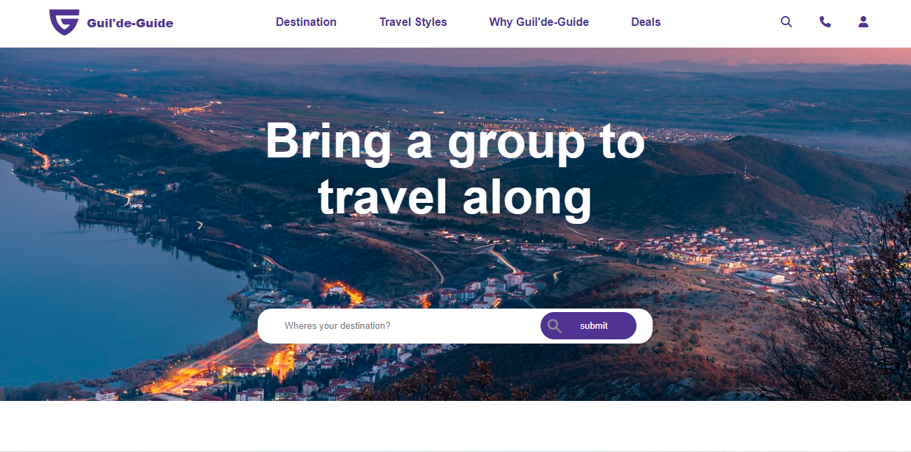

This traveling website has three pages: the Main page, the About Us page, and the Contact Us page. The Main page gives an overview, the About Us page shares company info, and the Contact Us page lets users get in touch.

  

Each page consist of the same header and banner:

 

The header houses a navigation list that push the user into different pages. A logo is also present withing the header
The header changes style as shrinks further (in order)

Set nav to display none

set info tab display to none while the humburger icon iline

  

The footer houses 3 section of links which are the info of our company, Support, and social links.
The footer changes style as shrinks further (in order)

footer content set its children into a 2 grid template

The Main page includes a hero banner with a title and a search bar for users to explore, along with a submit button.

Below that, there's content featuring advertisements for various travel destinations.
